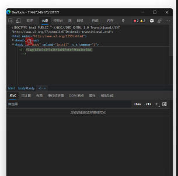
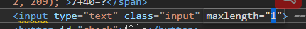
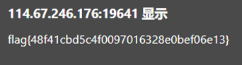
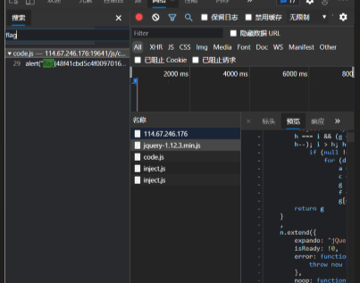
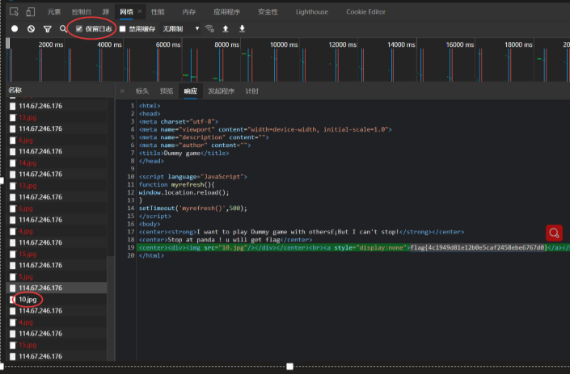
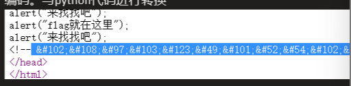
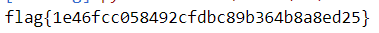

# bugku简单题


### 1.滑稽

进去页面。是动图。右键显示保存图片，并没有显示源代码

f12查看生成后的前端代码。找到flag




### 2.随机数字运算生成器

描述: 计算正确即可得到flag


发现只能输入一位数字。

#### 方法1：

f12改maxlength



输入正确，得到flag



#### 方法2：




### 3.你必须让它停下来

发现页面一直在刷新。偶尔会成功刷新一张图片

#### 方法1：

f12网络记录，保留日志。成功找到成功访问的那张图片




### 4.alert

查看页面源码，发现一串有规律编码。看到开头102想起f。说明这是ascii



python代码

```python
import re
a = "&#102;&#108;&#97;&#103;&#123;&#49;&#101;&#52;&#54;&#102;&#99;&#99;&#48;&#53;&#56;&#52;&#57;&#50;&#99;&#102;&#100;&#98;&#99;&#56;&#57;&#98;&#51;&#54;&#52;&#98;&#56;&#97;&#56;&#101;&#100;&#50;&#53;&#125;"
kk = re.compile(r'\d+')
b = re.findall(kk, a)
b = list(map(int, b))
for i in b:
    print(chr(i), end='')
```

得到flag



